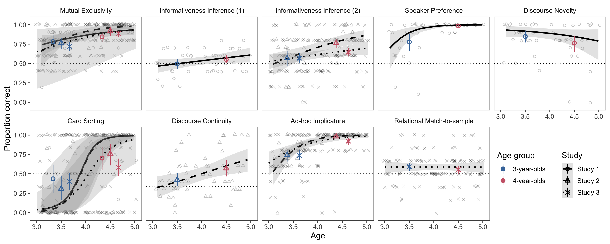
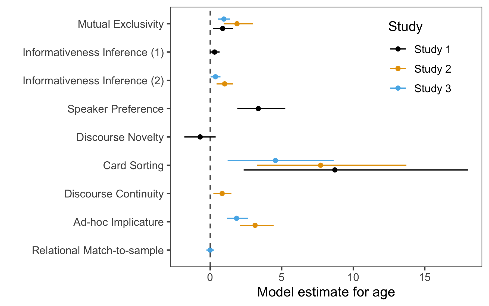
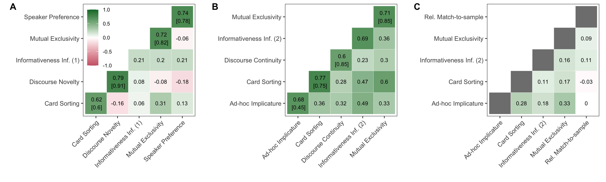
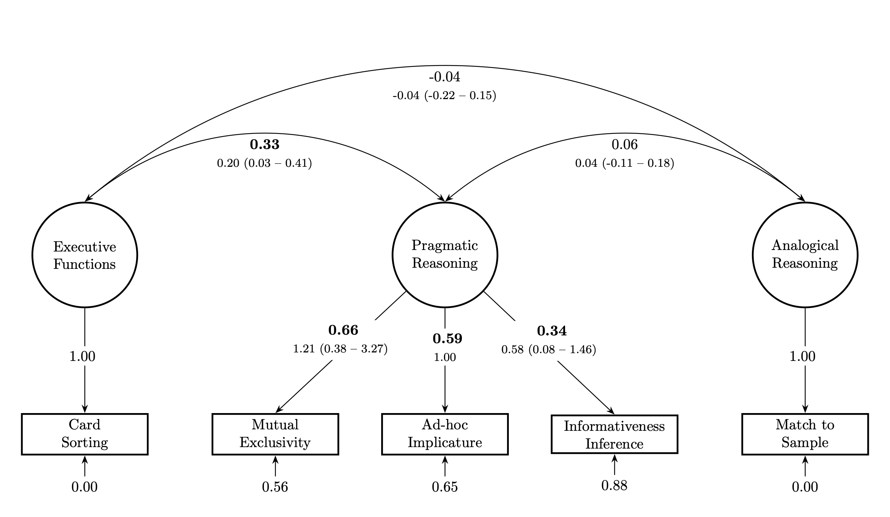
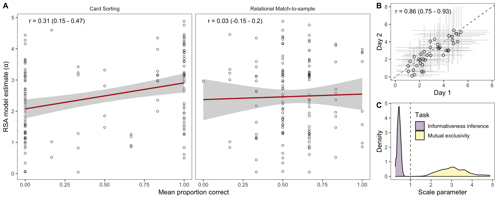

```{r setup, include = FALSE}
library("papaja")
library(tidyverse)
library(knitr)
library(brms)

```

```{r analysis-preferences}
# Seed for random number generation
set.seed(42)
knitr::opts_chunk$set(cache.extra = knitr::rand_seed)
```

```{r}
data <- bind_rows(
  read_csv("../data/data_r1.csv") %>%filter(task != "training") %>%mutate(study = "study1"),
  read_csv("../data/data_r2.csv") %>%filter(task != "training")%>%mutate(study = "study2"),
  read_csv("../data/data_r3.csv") %>%filter(task != "training")%>%mutate(study = "study3")
  ) %>%
  mutate(study = factor(study),
         id = paste(study, id, sep = "_"), 
         test_day = paste0("day", test_day))

```
# Introduction 

# Facets of pragmatic reasoning

# The challenges of studying individual differences

# The current study 


# Study 1

Methods and sample size were pre-registered at https://osf.io/6a723. All analysis scripts and data files can be found in the following repository: https://github.com/manuelbohn/pragBat. The same repository also contains the code to run the experiments. 

## Participants
```{r}
dem <- data%>%
  group_by(id)%>%
  summarise(study = unique(study),
            gender = unique(gender),
            age = unique(age),
            testdays = length(unique(test_day)))%>%
  group_by(study)%>%
  summarise(n = length(id),
            reli_n = sum(testdays == 2),
            female = sum(gender == "f"),
            mage = mean(age),
            lrange = range(age)[1],
            urange = range(age)[2])
```


For Study 1, we collected data from `r dem%>%filter(study == "study1")%>%pull(n)` children ($m_{age}$ = `r dem%>%filter(study == "study1")%>%pull(mage)`, range$_{age}$: `r dem%>%filter(study == "study1")%>%pull(lrange)` - `r dem%>%filter(study == "study1")%>%pull(urange)`, `r dem%>%filter(study == "study1")%>%pull(female)` girls) of which `r dem%>%filter(study == "study1")%>%pull(reli_n)` were tested twice. For most children, the two test sessions were two days apart; the longest time difference was six days. Children came from an ethnically homogeneous, mid-size German city (~550,000 inhabitants, median income €1,974 per month as of 2020); were mostly monolingual and had mixed socioeconomic backgrounds. The study was approved by an internal ethics committee at the Max Planck Institute for Evolutionary Anthropology. Data was collected between November 2019 and January 2020. 

## Material and Methods

The study was presented as an interactive picture book on a tablet computer. The tasks were programmed in `HTML/JavaScript` and run in a web browser. Pre-recorded sound files were used to address the child (one native German speaker per animal). Children responded by touching objects on the screen. Children were tested in a quiet room in their daycare or in a separate room in a child laboratory. An experimenter guided the child through the study, selecting the different tasks and advancing within each task. In the beginning of the study, children completed a touch training to familiarize themselves with selecting objects. After a short introduction to the different animal characters, children completed the following six tasks. Figure \@ref(fig:fig1) shows screenshots for each task and the order in which they were presented.

### Training

An animal was standing on a pile between two tables. On each table, a familiar object was located. The animal asked the child to give them one of the objects (e.g., "Can you give me the car"). the objects were chosen so that children of the youngest age group would easily understand them (car and ball). This procedure familiarized the child with the general logic of the animals making requests and the child touching objects. There were two training trials. 

### Mutual exclusivity

This task was directly taken from @bohn2021young. The task layout and the procedure was the same as in the training. In each trial, one object was a novel object (drawn for the purpose of this study) while the other one was likely to be familiar to children. Both object types changed from trial to trial. Following @bohn2021young, the familiar objects varied in terms of the likelihood that they would be familiar to children in the age range (carrot, duck, eggplant, garlic, horseshoe). For example, we assumed that most 3-year-olds would recognize a carrot, whereas fewer children would recognize a horseshoe. The animal always used a novel non-word (e.g., gepsa) in their request. We reasoned that children would identify the novel object as the referent of the novel word because they assumed the animal would have used the familiar word if they wanted to request the familiar object. Children's response was thus coded as correct if they selected the novel object. There were five trials, with the side on which the novel object appeared pseudo-randomized.  

### Informativeness inference

The task was directly taken from @bohn_tessler_merrick_frank_2019. Th animal was standing between two trees with objects hanging in them. In one tree, there were two objects (type A and B) and in the other tree there was only one (type B). The animal turned to the tree with the two objects and labelled one of the objects. It was unclear from the animal's utterance, which of the two objects they were referring to. We assumed that children would map the novel word onto the object of type A because they expected the animal to turn to the tree with only the object of type B if their intention was to provide a label for an object of type B. Next, the trees were replaced by new ones, one of which carried an object of type A and the other of type B. The animal then said that one of the trees had the same object as they labelled previously (using the same label) and asked the child to touch the tree. We coded as correct if the child selected the tree with the object of type A. The first two trials were training trials, in which there was only one object in each tree. There were five test trials. The location of the tree with the two objects in the beginning of each trial was pseudo-randomized and so was the location of the objects when the new trees appeared.  

### Speaker preference

This task was also taken from @bohn_tessler_merrick_frank_2019. The animal was standing between the two tables, each of which had a novel object (drawn for the purpose of the study) on it. The animal turned to one table, pointed at the object and said that they very much liked this object (using a pronoun instead of a label). Next, the animal turned to the other table and said that they really did not like the object (again, using a pronoun and no label). Then the animal turned towards the participant and used a novel label to request an object in an excited tone. We assumed that children would track the animal's preference and identify the previously liked object as the referent. Thus, we coded as correct if the child selected the object the animal expressed preference for. There were five test trials. The location of the preferred object as well as whether the animal first expressed liking or disliking was pseudo-randomized across trials

### Discourse novelty

This task was taken from @bohn2021young. Once again, the animal was standing between the two tables. One table was empty whereas there was a novel object on the other table. The animal turned towards the empty table and commented on its emptiness. Next, the animal turned to the other table and commented (in a neutral tone) on the presence of the object (not using a label). The animal then briefly disappeared. In the absence of the animal a second novel object appeared on the previously empty table. Then the animal returned and, facing the participant, asked for an object in an excited tone. We assumed that children would track which object was new to the ongoing interaction and identify the object that was new in context as the referent. We coded as correct when children selected the object that appeared later. There were five test trials. The location of the empty table and whether the animal first commented on the presence or absence of an object was pseudo-randomized across trials

### Card sorting

This task was modeled after @zelazo2006dimensional. The child saw to cards, a blue rabbit on the left and a red boat on the right. The experimenter introduced the child to the color game they would be playing next. In this game, all blue cards (irrespective of object depicted) would go to the left card and all red cards to the right. Next, a third card appeared in the middle of the screen (red rabbit or blue boat) and the experimenter demonstrated the color sorting by moving the card to the one with the same color. After a second demonstration trial, the child started to do the color sorting by themselves. After six trials, the experimenter said that they were now going to play a different game, the shape game, according to which all rabbits would go to the card with the rabbit (left) and all boats to the card with the boat (right). The experimenter repeated these instructions once and without any demonstration the child continued with the sorting according to the new rule. There were six test trials. The shape on the card was pseudo-randomized across trials. We only coded the trials after the rule change and coded as correct when the child sorted according to shape.     

Each child received exactly the same version of each task and completed the tasks in the same order, with the same order on the two days. This ensured comparability of performance across children.  

(ref:figlab1) Overview of the tasks used in Study 1 to 3. Pictures show screenshots from each task. The vertical order corresponds to the order of presentation in each study. The colors group the tasks along the (Assumed) cognitive processes involved. Blue: utterance-based inferences. Red common ground/discourse-based inferences. Green: Executive functions. Green: Analogical reasoning.

```{r fig1, include = T, fig.align = "center", fig.cap = "(ref:figlab1)", out.width="100%"}
knitr::include_graphics("./figures/figure1.png")
```

## Analysis

We analysed the data in three steps. First we investigated developmental effects in each task, then we assessed re-test reliability and finally, we analysed relations between the tasks.  

All analysis were run in `R` [@R-base] version 4.1.2. Regression models were fit as Bayesian generalized linear mixed models (GLMM) using the function `brm` from the package `brms` [@burkner2017brms]. We used default priors for all analysis. 

To estimate developmental effects in each task, we fit a GLMM predicting correct responses (0/1) by age (centered at the mean) and trial number (also centered). The model included random intercepts for each participant and random slopes for trial within participants (model notation in `R`: `correct ~ age + trial + (trial|id)` ). For each task, we inspected and visualized the posterior distribution (mean and 95% Credible Interval (CrI)) for the age estimate.

We assessed re-test reliability in two ways. First, for each task we computed the proportion of correct trials for each individual in the two test sessions and then used  Pearson correlations to quantify re-test reliability. Second, we used a GLMM based approach suggested by @rouder2019psychometrics. Here, a GLMM was fitted to the trial-by-trial data for each task with a fixed effect of age, a random intercept for each participant and a random slope for test day (`correct ~ age + (0+test_day|id)`)^[The notation `0+test_day` yields a separate intercept estimate for each test day and subject instead of an intercept estimate for day 1 and a slope for the difference between day 1 and day 2. As a consequence, the model estimates the correlation between the two test days instead of a correlation between an intercept and the slope for test day.]. The model yields a participant specific estimate for each test day and also estimates the correlation between the two. This correlation can be interpreted as the re-test reliability. This approach has several advantages. First, it uses the trial-by-trial data and avoids information loss that comes with data aggregation. Second, it uses hierarchical shrinkage to obtain better participant specific estimates. Finally, it allows us to get an age-independent estimate for reliability. One worry when assessing re-test reliability in developmental studies is that re-test correlations can be high because of domain general cognitive gains and not because of task-specific individual differences. By including age as a fixed effect in the model, the estimates for each participant are independent of age and so is the correlation between estimates for the two test days -- the re-test reliability.

Finally, we used that aggregated data from both test days for each participant and task to compute Pearson correlations between the different tasks. Given the small sample size in Study 1, this part of the analysis is mostly exploratory. 

## Results

We found developmental effects in most of the tasks. Figure \@ref(fig:fig2) shows the data and visualizes the developmental trajectories based on the model. Figure \@ref(fig:fig3) shows the model estimates for age. In the mutual exclusivity task, performance was reliably above chance level and increased with age. For informative inference, the pattern was quite different: Performance was at chance level with only minor developmental gains. In the speaker preference task, performance was again clearly above chance with developmental gains resulting in a ceiling effect for older children. In the discourse novelty task, performance was also above chance with no clear developmental effects. The card sorting task showed the strongest developmental effects with younger children performing largely below chance and older children performing above chance. 

Re-test reliability was high for most tasks (see Figure \@ref(fig:fig2)). Raw correlations between the two test sessions was above .7 for mutual exclusivity, speaker preference and discourse novelty. With .62 it was slightly lower for card sorting. The model based -- age independent -- reliability estimates yielded similar results suggesting that the tasks did capture task specific individual differences. A notable exception was the informativeness inference task, which was not reliable according to any of the methods of computing re-test correlations. We suspect the overall low variation in performance to be responsible for this. 

```{r, echo = F}
cors <- read_csv("../saves/by_task_correlations.csv")
```

Most correlations between the tasks were low and ranged between *r* = -0.2 and 0.2 (see Figure \@ref(fig:fig2)). A notable exception was the correlation between mutual exclusivity and card sorting with *r* = `r cors%>%filter(study == "study1", task1 == "mutual_exclusivity", task2 == "card_sorting")%>%pull(rho)` (95% CI[`r cors%>%filter(study == "study1", task1 == "mutual_exclusivity", task2 == "card_sorting")%>%pull(lci)` - `r cors%>%filter(study == "study1", task1 == "mutual_exclusivity", task2 == "card_sorting")%>%pull(uci)`]). 

(ref:figlab2) Results by task for studies 1 to 3. Each panel shows the results for one task. Regression lines show the predicted developmental trajectories (with 95% CrI) based on by-task GLMMs, with the line type indicating the study. Colored points show age group means (with 95% CI based on non-parametric bootstrap) with the different shapes corresponding to the different studies. Light shapes show the mean performance for each subject by study. Dotted line shows level of performance expected by chance.

```{r fig2, include = T, fig.align = "center", fig.cap = "(ref:figlab2)", out.width="100%"}

```

(ref:figlab3) Model estimates (with 95% CrI) for age based on GLMMs for each task and study. 

```{r fig3, include = T, fig.align = "center", fig.cap = "(ref:figlab3)", out.width="60%"}

```

(ref:figlab4) Re-test and task correlations for Study 1 (A), 2 (B) and 3 (C). The diagonal in A and B shows the re-test reliability based on aggregated raw test scores (top row) and based on a GLMM that accounted for participant age (see main text for details).

```{r fig4, include = T, fig.align = "center", fig.cap = "(ref:figlab4)", out.width="100%"}

```


## Discussion

Study 1 showed that the different tasks were age appropriate and reliable. A notable exception was the informativeness inference task which generated to systematic variation in the age range we studied here. Correlations between the tasks were generally low, with the notable exception of the relation between mutual exclusivity and card sorting. Given the small sample size, we want to avoid overly strong claims, however, it was interesting to see that the relation between the two tasks tapping into common ground based inferences (speaker preference and discourse novelty) were -- if anything -- negatively correlated.

# Study 2

Based on these results od Study 1, we compiled a new set of tasks for Study 2. We retained the mutual exclusivity and card sorting tasks because of the interesting relation between the two found in Study 2. We simplified the informativeness inference task to be more age appropriate with the hope to induce more variation in performance. We removed the speaker preference and discourse novelty tasks -- despite their excellent re-test reliability -- because they seemed to be unrelated to one another and also unrelated to the other tasks. The new tasks focused on ad-hoc implicature and discourse continuity. As noted in the introduction, we had theoretical reasons to expected the ad-hoc implicature task to be related to the mutual exclusivity and informativeness inference tasks. We had no such strong predictions for the discourse continuity task.

Methods and sample size were pre-registered at https://osf.io/hp9f7. Data, analysis scripts and experiment code can be found in the associated online repository. 

## Participants

Participants for Study 2 were recruited from the same general population. We collected data from `r dem%>%filter(study == "study2")%>%pull(n)` children ($m_{age}$ = `r dem%>%filter(study == "study2")%>%pull(mage)`, range$_{age}$: `r dem%>%filter(study == "study2")%>%pull(lrange)` - `r dem%>%filter(study == "study2")%>%pull(urange)`, `r dem%>%filter(study == "study2")%>%pull(female)` girls) of which `r dem%>%filter(study == "study2")%>%pull(reli_n)` were tested twice. The two test sessions were again two days apart; the longest time difference was 14 days. Data was collected between March and October 2020.

## Material and Methods

The general setup and mode of presentation was the same as in Study 1. We added two new tasks and modified the informativeness inferences task, which we will describe in detail below. The mutual exclusivity and card sorting tasks were the same as in Study 1. 

### Informativeness inference

The general structure of the task was the same as in Study 1, however, we replaced the stimuli by the ones used by @frank2014inferring. We suspected that children did not treat the novel objects hanging in the tree as properties of the tree but the tree as a "container" for the novel objects. The alleged inference, however, relies on seeing the objects as properties of the referent. With the new stimuli, we emphasized that the novel objects were mere properties of the referent by making the referent more salient and more different across trials. The animal was located between two identical objects, which had different properties (see Figure \@ref(fig:fig1)). For example, the child saw two bears, one with a Pharaoh-style crown and a match in its hand, the other only with the match. The animal then turned to the object with the two properties and described it by referring to one of the properties (e.g., a bear with a [non-word]). Next, the objects disappeared, and the same objects re-appeared but this time, each of them had only one property (e.g., one bear with a crown, the other with the match). The animal then asked which of these objects had the aforementioned property (e.g., which bear has a [non-word]). We coded as correct if the child selected the object with the property that was unique to the object during labeling. The first two trials were training trials, in which each object only had one property. There were five test trials. The location of the object with the two properties in the beginning of each trial was pseudo-randomized and so was the location of the properties when the new objects appeared. 

### Discourse continuity

This task was directly taken from @bohn_le_peloquin_koymen_frank_2020. Children were told that they were going to visit the animals at their place. The animal greeted the child and told them that they would show them their things. During exposure trials, the child saw three objects from three different categories (e.g., train (vehicle), drum (instrument), orange (fruit); see Figure \@ref(fig:fig1)). The animal named of the objects and asked the child to touch it. On the next exposure trial, the child saw three new objects but from the same categories (e.g., bus (vehicle), flute (instrument), apple (fruit)). The animal asked the child to touch the object from the same category as previously (only naming the object, not the category). There were 5 such exposure trials. On the following test trial, the animal used a pronoun to refer to one of the objects (i.e., can you touch *it*). We assumed that children would use the exposure trials to infer that the animal was talking about a certain category and would use this knowledge to identify the referent of the pronoun.Children received five test trials, each with a different category as the target. The position of the objects in exposure trials as well as test trials was pseudo-randomized.    

### Ad-hoc implicature

This task used the general procedure and stimuli developed in @yoon2019role. The animal was located in a window, looking out over two objects (see Figure \@ref(fig:fig1)). Both objects were of the same kind, but had different properties. As properties we chose objects that were well known to children of that age range. One object had one property (A) and while the other had two (A and B). For example, objects were lunchboxes, one with an orange and the other with an orange and an apple. The animal then asked the child to hand them their object which was the one with the property that both objects shared (A). We assumed that children would pick the object with only property A because they expected the animal to name  property B if they had wanted to refer to the object with both properties. There were five test trials, preceded by two training trials in which the objects did not share a common property. The positioning of the objects (left and right) was pseudo-randomized

## Analysis

We used the same methods to analyse the data as in Study 1. 

## Results

We found substantial developmental gains in all five tasks (Figure \@ref(fig:fig2) and \@ref(fig:fig3)). For mutual exclusivity and ad-hoc implicature performance was above chance across the entire age range. For the informativeness inference and discourse continuity tasks, performance was close to chance for younger children and reliably above it for older children. Like in Study 1, we found the strongest developmental effect for card sorting, with performance below chance for 3-year-olds and above chance for 4-year-olds. 

Re-test reliability based on aggregated data was good for all tasks with most estimates around 0.7. The model-based reliability estimates were similar, with lower values for ad-hoc implicature and higher ones for discourse continuity. Notably, the informativeness inference task showed a much-improved re-test reliability compared to Study 1. 

Correlations between tasks were generally higher compared to Study 1. In fact, confidence intervals for correlation coefficients were not overlapping with 0 except for the correlation between the discourse continuity and informativeness inference tasks (Figure \@ref(fig:fig4). Once again, we found the strongest relation between card sorting and mutual exclusivity (*r* = `r cors%>%filter(study == "study2", task1 == "mutual_exclusivity", task2 == "card_sorting")%>%pull(rho)`, 95% CI[`r cors%>%filter(study == "study2", task1 == "mutual_exclusivity", task2 == "card_sorting")%>%pull(lci)` - `r cors%>%filter(study == "study2", task1 == "mutual_exclusivity", task2 == "card_sorting")%>%pull(uci)`]). Other notable relations were those between card sorting and informativeness inference (*r* = `r cors%>%filter(study == "study2", task1 == "simple_inf", task2 == "card_sorting")%>%pull(rho)`, 95% CI[`r cors%>%filter(study == "study2", task1 == "simple_inf", task2 == "card_sorting")%>%pull(lci)` - `r cors%>%filter(study == "study2", task1 == "simple_inf", task2 == "card_sorting")%>%pull(uci)`]) as well as between ad-hoc implicature and informativeness inference (*r* = `r cors%>%filter(study == "study2", task1 == "simple_inf", task2 == "ad_hoc_implicature")%>%pull(rho)`, 95% CI[`r cors%>%filter(study == "study2", task1 == "simple_inf", task2 == "ad_hoc_implicature")%>%pull(lci)` - `r cors%>%filter(study == "study2", task1 == "simple_inf", task2 == "ad_hoc_implicature")%>%pull(uci)`]). 

## Discussion

In Study 2 we found good results from a measurement perspective: all tasks had acceptable re-test reliability. This included the informativeness inference task which had deficits in that respect in Study 1. Higher average performance and increased variability suggest that our changes to the stimuli did make the task easier for children.

Like in Study 1, we found a relatively strong correlation between the mutual exclusivity and card sorting tasks. This corroborates the idea that these tasks share common processes. We also found substantial relations between the three utterance-based inference tasks (mutual exclusivity, ad-hoc implicature, informativeness inference). Furthermore, the correlations between tasks were lower when discourse continuity was involved -- though the numerical difference was minimal.

# Study 3

In Study 3, we focused explicitly on the relations between the different tasks. In particular, we explored the idea that the three utterance-based inference tasks share common cognitive processes. Once again, we also included the card sorting task and added a new task of analogical reasoning for which we did not expect strong relations with the other tasks. To be able to test these predictions, we collected data from a comparatively larger sample of children.

The reliability estimates from Study 1 and 2 helped us plan the sample size for Study 3. The focal tasks had a re-test reliability around 0.7. Because the highest plausible correlation between two tasks is the product of their reliabilities (higher correlations would mean that the task is more strongly related to a different task than to itself), the highest we could expect were correlations between two tasks around 0.7 * 0.7 = 0.49. We planned our sample so that we could detect correlations between two tasks of 0.3 with 95% power^[The first author drafted a pre-registration and shared it with the last author but forgot to register it at OSF. Thus, the study was not officially pre-registered.]. Data, analysis scripts and experiment code can be found in the associated online repository. 

## Participants

For Study 3, we collected data from `r dem%>%filter(study == "study3")%>%pull(n)` children ($m_{age}$ = `r dem%>%filter(study == "study3")%>%pull(mage)`, range$_{age}$: `r dem%>%filter(study == "study3")%>%pull(lrange)` - `r dem%>%filter(study == "study3")%>%pull(urange)`, `r dem%>%filter(study == "study3")%>%pull(female)` girls) from the same general population. Data was collected between June and November 2021. Children were tested only once. 

## Materials and Methods

From Study 2, we used the the mutual exclusivity, ad-hoc implicature, informativeness inference and card sorting tasks. We added the relational match-to-sample task, which we now describe in more detail. 

### Relational match-to-sample

The task was modeled after and used the original stimuli from @christie2014language. The child saw three cards, one on top (the sample) and two at the bottom (the potential matches; see Figure \@ref(fig:fig1)). The experimenter guided the child through the study and read out the instructions. The child was instructed to match the sample card to one of the lower ones based on similarity, that is, they were instructed to pick the card that was "like" the sample. All cards had two geometrical shapes of the same color on them. The sample card showed to identical shapes and so did one of the potential matches. The other card showed two different shapes. We assumed that children would match the sample to the match that showed the same relation between shapes (sameness). Children received six test trial, preceded by two training trials in which one of the potential matches was identical to the sample. The position of the same-match was pseudo randomized.   

## Analysis

Study 3 had only one test session. Therefore, we did not investigate re-test reliability. We estimated age effects and raw correlations between tasks in the same way as in Studies 1 and 2. We used two additional methods to investigate the structure of individual differences between tasks. 

First, we used Confirmatory Factor Analysis (CFA). Models were fit in a Bayesian framework using the `R` package `blavaan` [@merkle2018blavaan] using default priors. As outlined above, our focal model assumed that mutual exclusivity, ad-hoc implicature and informativeness inference load on a common pragmatics factor. The card sorting and relational match-to-sample tasks were included as separate factors.  We used Posterior Predictive P-Values (PPP) to evaluate model fit [@lee2012basic]. A good model fit is indicated by a PPP close to 0.5 and should not be smaller than 0.1 [@cain2019fit]. We also fit two alternative models: one including only a single factor on which all tasks loaded and a second with a separate factor for each task. We compared models using WAIC (widely applicable information criterion) scores and weights [@mcelreath2018statistical]. WAIC is an indicator of out-of-sample predictive accuracy with lower values indicating better fit. WAIC weights transform WAIC values to give the probability that a particular model (out of the models considered) provides the best out-of-sample predictions. Within the focal model, we inspected the posterior estimates (with 95%CrI) for the factor loadings and the variance in the task explained by the factor for the three pragmatics tasks. In addition, we evaluated the correlations between the pragmatics factor and the other two tasks.

Second, we used computational cognitive models from the Rational Speech Act (RSA) framework to relate the three pragmatics tasks to one another [@frank2012predicting; @goodman2016pragmatic]. In contrast to the CFA model above, the RSA models are models of the tasks, and not of the data. That is, they include a schematic representation of the experimental tasks and provide a computational account of how participants make inferences in this context. RSA models see pragmatic inferences as a form of Bayesian social reasoning where the listener tries to infer the speaker' meaning (here: the intended referent) by assuming that the speaker is helpful and informative. Being helpful and informative means that the speaker chooses a message based on the probability that it would help the listener would recover the speaker's intended meaning. Thus, RSA models have a recursive structure in which the the listener reasons about a speaker who is reasoning about the listener. To avoid an infinite regress, the speaker is assumed to reason about a literal listener, who interprets words according to their literal semantics. 

The studies from which we took the mutual exclusivity and informativeness inference tasks also formalized these tasks in an RSA-style model [@bohn_tessler_merrick_frank_2019; @bohn2021young]. We refer to this earlier work for more details and a mathematical description of the models. For the present study, we formalized the ad-hoc implicature task within the same RSA framework. All three models shared one common parameter: $\alpha$. Within the RSA framework, $\alpha$ has the conceptual role of indicating how informative the listener thinks the speaker is. 

This commonality offers a way of relating performance in the three tasks to one another by constraining the three models to use the same value for $\alpha$. We then used Bayesian inference to estimate the posterior distribution for $\alpha$ that best explained performance in the three tasks. To adapt this framework to the study of individual differences, we allowed a separate parameter for each participant ($\alpha_i$). We estimated $\alpha_i$ in a hierarchical model as a deviation from a hyper parameter: $\alpha_i \sim \mathcal{N}(\alpha_j, \sigma^\alpha)$. Given the developmental nature of our data, we defined $\alpha_j$ via a linear regression as a function of the child's age ($age_i$): $\alpha_j = \beta^\alpha_0 + age_i \cdot \beta^\alpha_1$. Thus, the participant specific value for $\alpha$ was not only constrained by the performance in the three tasks but also by the child's age.

To account for differences in difficulty between the tasks due to other factors, we added a scale parameter to the model that adjusted $\alpha$ for each task in comparison to a reference task (ad-hoc implicature).

To validate this approach, we first applied this model to the data from Study 2 -- separate for each test session. This allowed us to compute the re-test reliability of $\alpha$ and see if it captures individual differences equally well compared to the raw test scores. After finding excellent re-test reliability, we applied it to the data from Study 3 and correlated the results with the the card sorting and relational match-to sample tasks. For these correlational analysis, we converted the posterior distribution for each participant into a single value by taking the mode (and 95% highest density interval -- HDI). The cognitive models were implemented in `WebPPL` [@dippl] and the corresponding code, including information on prior distributions, can be found in the associated online repository. 

## Results

The age effects in Study 3 largely replicate those of Study 2 for the four overlapping tasks (see Figure \@ref(fig:fig2) and \@ref(fig:fig3). There were no substantial developmental gains in the newly added relational match-to-sample task and performance was close to chance for both age groups. Thus -- in the absence of information on re-test reliability -- it is unclear if the variation in performance reflects systematic individual differences in analogical reasoning or not.

Overall, the correlations between the tasks were lower compared to Study 2. This was to some extend expected given that there were only half the number of trials per task in Study 3 and, with that, less room for capturing individual differences. Nevertheless, the overall pattern rsembles that found in Study 2 (Figure \@ref(fig:fig4)). We saw the strongest bi-variate relation between the mutual exclusivity and the ad-hoc implicature task (*r* = `r cors%>%filter(study == "study3", task1 == "mutual_exclusivity", task2 == "ad_hoc_implicature")%>%pull(rho)`, 95% CI[`r cors%>%filter(study == "study3", task1 == "mutual_exclusivity", task2 == "ad_hoc_implicature")%>%pull(lci)` - `r cors%>%filter(study == "study3", task1 == "mutual_exclusivity", task2 == "ad_hoc_implicature")%>%pull(uci)`]) followed by ad-hoc implicature and card sorting (*r* = `r cors%>%filter(study == "study3", task1 == "card_sorting", task2 == "ad_hoc_implicature")%>%pull(rho)`, 95% CI[`r cors%>%filter(study == "study3", task1 == "card_sorting", task2 == "ad_hoc_implicature")%>%pull(lci)` - `r cors%>%filter(study == "study3", task1 == "card_sorting", task2 == "ad_hoc_implicature")%>%pull(uci)`]). The relational match-to-sample task showed no substantial correlations with any of the other tasks. 

```{r}
model_comparison <- read_csv("../saves/bcfa_model_comparison.csv")

model_fit <- read_csv("../saves/cfa_fit_measures.csv")

model_est <- read_csv("../saves/cfa_estimates.csv")
```

(ref:figlab5) Graphical overview of CFA model for Study 3. Arrows from latent variable (circles) to observed variable (rectangles) show factor loadings. Bottom arrows to observed variables give the residual variance not explained by the factor. Bent arrows between latent variables show correlations. Bottom rows show model estimates with 95% CrI. Top rows show standardized estimates (bold if 95 % CrI does not include 0). 

```{r fig5, include = T, fig.align = "center", fig.cap = "(ref:figlab5)", out.width="100%"}

```

Our focal model in the confirmatory factor analysis including a latent factor for pragmatic reasoning fit the data well (PPP = `r round(model_fit%>%filter(index == "ppp", model == "fit1")%>%pull(value),3)`) and with a WAIC of `r round(model_comparison%>%filter(model == "fit1")%>%pull(waic),2)` (se = `r round(model_comparison%>%filter(model == "fit1")%>%pull(waic_se),2)`, weight = `r round(model_comparison%>%filter(model == "fit1")%>%pull(waic_weight),2)`) better compared to the two alternative models (individual factors model: PPP = `r round(model_fit%>%filter(index == "ppp", model == "fit3")%>%pull(value),3)`, WAIC = `r round(model_comparison%>%filter(model == "fit3")%>%pull(waic),2)`, se = `r round(model_comparison%>%filter(model == "fit3")%>%pull(waic_se),2)`, weight = `r round(model_comparison%>%filter(model == "fit3")%>%pull(waic_weight),2)`; one factor model: PPP = `r round(model_fit%>%filter(index == "ppp", model == "fit2")%>%pull(value),3)`, WAIC = `r round(model_comparison%>%filter(model == "fit2")%>%pull(waic),2)`, se = `r round(model_comparison%>%filter(model == "fit2")%>%pull(waic_se),2)`, weight = `r round(model_comparison%>%filter(model == "fit2")%>%pull(waic_weight),2)`). Figure \@ref(fig:fig5) shows that factor loadings for the individual tasks as well as their residual variance. The latent pragmatic reasoning factor best explained the mutual exclusivity task, followed by the ad-hoc implicature and the informativeness inference task. The correlation between pragmatic reasoning and executive functions (indicated by the card sorting task) was estimated to be reliably different from zero (*r* = 0.33; model estimate = `r round(model_est%>%filter(index == "prag~~card")%>%pull(value),2)`, 95% CrI [`r round(model_est%>%filter(index == "prag~~card")%>%pull(lower),2)` - `r round(model_est%>%filter(index == "prag~~card")%>%pull(upper),2)`]). There was no systematic relation between pragmatic reasoning and analogical reasoning (as indicated by the relational match-to-sample task): *r* = 0.06; model estimate = `r round(model_est%>%filter(index == "prag~~match")%>%pull(value),2)`, 95% CrI [`r round(model_est%>%filter(index == "prag~~match")%>%pull(lower),2)` - `r round(model_est%>%filter(index == "prag~~match")%>%pull(upper),2)`]. However, the latter result should be taken with a groin of salt given the unknown psychometric properties of the relational match-to-sample task.

```{r}

rsa_cor <- read_csv("../saves/rsa_cor_estimates.csv")

```

The results of the analysis based on the cognitive model yield similar conclusions compared to the confirmatory factor analysis (Figure \@ref(fig:fig6)). Participant specific speaker informativeness parameters ($\alpha$) were correlated with performance in the card sorting (*r* = `r rsa_cor%>%filter(task == "Card Sorting")%>%pull(cor)`, 95% CI[`r rsa_cor%>%filter(task == "Card Sorting")%>%pull(lci)` - `r rsa_cor%>%filter(task == "Card Sorting")%>%pull(uci)`]) but not the relational match-to-sample task (*r* = `r rsa_cor%>%filter(task == "Relational Match-to-sample")%>%pull(cor)`, 95% CI[`r rsa_cor%>%filter(task == "Relational Match-to-sample")%>%pull(lci)` - `r rsa_cor%>%filter(task == "Relational Match-to-sample")%>%pull(uci)`]). The same limitations apply to the latter result as for the confirmatory factor analysis. 

(ref:figlab6) Results of cognitive model analyses. A: Correlation between the speaker informativeness parameter $\alpha$ and the paerformance in the card sorting and relational match to sample tasks. Regression line (with 95% CI) is based on a linear model. B: Re-test reliability for $\alpha$ based on the data from Study 2. C: Scale parameter for $\alpha$ in relation to the ad-hoc implicature task. Values below 1 indicate a more difficult task, values above 1 an easier task. Correlation coefficients show Pearson correlation with 95% CI.

```{r fig6, include = T, fig.align = "center", fig.cap = "(ref:figlab6)", out.width="100%"}

```

## Discussion


# General Discussion

Present six, reliable (even when corrected for age) and ready to use tasks that cover a range of phenomena subsumed under pragmatic inference. WE divided them up into utternace based and interaction based and more systematic realtions between utternace based. Nevertehless, the others need to be explored more

Across studies we saw relations between utterance based inference tasks. From different theoretical perspectives, they might be more or less obvious, especially for ME. From our perspective they make a lot of sense - we explicate this view in our model. 

Why is there this relation with card sorting? The advantage of using a cognitive model to study individual differences is that the parameters have a more psychologically plausible interpretation compared to data analytic methods. If e take the model for real, we can speculate why card sorting matters. Switching rules requires seeing stimuli in different light - focus on different aspect of them, consider alternative ways of seeing them, not go with what you did previously. The inference in the model is driven by not going just with what is true but  considering alternative utterances - some commonalities here that might be responsible - need to be modeled explicitly and contrasted to alternative views. (check other theoretical accounts on that)


\newpage

# References

\begingroup
\setlength{\parindent}{-0.5in}
\setlength{\leftskip}{0.5in}

<div id="refs" custom-style="Bibliography"></div>
\endgroup
